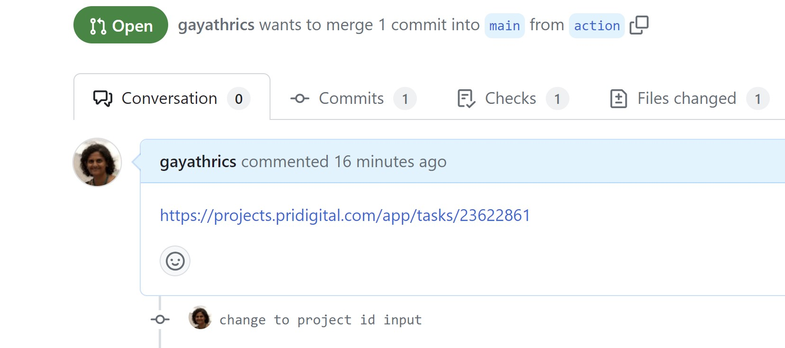
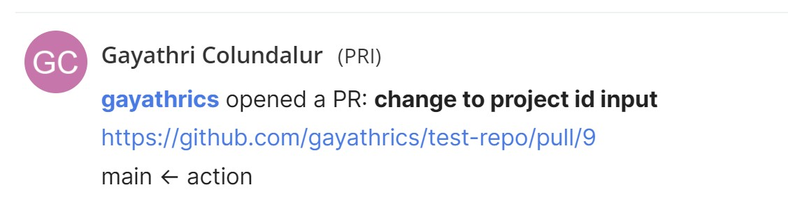

# github-teamwork-pull-request
Update teamwork when a PR is opened, closed or merged

## You Need
Teanwork URI - your organization URI. custom domains also work.
Teamwork ProjectID - The project id in teamwork where tasks are to be updated
Teamwork Board PR opened column - The column where you want the task to be move when a PR is opened
Teamwork Board PR closed column - The column where you want the task to be move when a PR is closed
Teamwork Board PR merged column - The column where you want the task to be move when a PR is merged

## How does it work
Create a PR in github and add the task link in the body of the pr


The task is updated
1. The task is moved to the appropriate board column
2. Tags are added or removed - PR Open, PR Closed, PR Merged
3. The task progress is update
4. A comment is added with a link to the pull request



## Getting Started
1. Create the needed tags in the project if it does not exist
2. Create a folder in your project root to house the workflow .github\workflows
3. Copy the following into a yml file in the workflows folder
```
name: teamwork

on:
  pull_request:
    branches:
      - 'main'
    types: [opened, closed]
  

jobs:
  teamwork-sync:
    runs-on: ubuntu-latest
    name: Teamwork Sync
    steps:
      - name: Teamwork sync action step
        id: twsync
        uses: gayathrics/github-teamwork-pull-request@v1.1
        with:
          GITHUB_TOKEN: ${{ secrets.GITHUB_TOKEN }}
          TEAMWORK_URI: ${{ secrets.TEAMWORK_URI }}
          TEAMWORK_API_KEY: ${{ secrets.TEAMWORK_API_KEY }}
          TEAMWORK_PROJECT_ID: '485369'
          TEAMWORK_OPENED_COLUMN: 'Ready for Peer Review'
          TEAMWORK_CLOSED_COLUMN: 'In Progress'
          TEAMWORK_MERGED_COLUMN: 'Ready to Test (In Staging)'
      # Use the output from the previous step
      - name: Get the output taskid
        run: echo "The taskid is ${{ steps.twsync.outputs.taskid }}"
```
4. Update the input fields to suit your project
5. Add the Teamwork URI and Teamwork API key as project (secrets)[https://docs.github.com/en/actions/security-guides/encrypted-secrets] in github.
6. Commit the changes to a feature branch
7. Open a new PR
